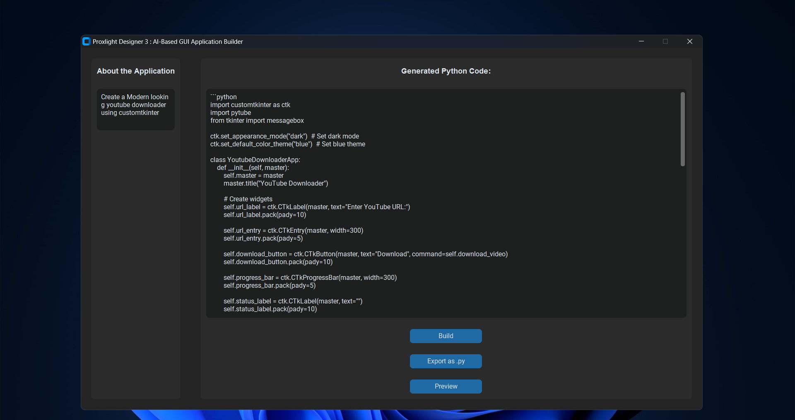
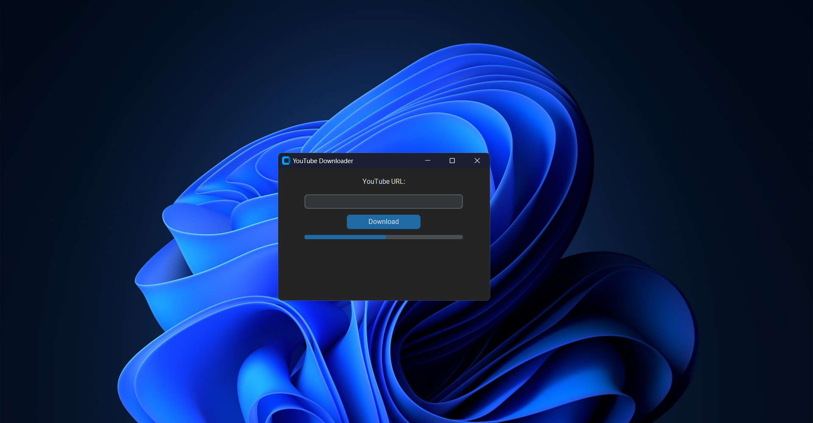

# Proxlight Designer 3 : AI-Based GUI Application Builder 🌟

## 🚀 Overview

Welcome to **Proxlight Designer 3**, an innovative tool that combines the power of **CustomTkinter** and the **Google Gemini API** to help you effortlessly create Python GUI applications. Describe your dream application, and let our AI do the rest! 🌈✨

## ✨ Features

- **🖥️ User-Friendly Interface**: Experience a sleek and intuitive GUI built with CustomTkinter.
- **🤖 AI-Powered Code Generation**: Leverage the Google Gemini API to generate Python code from your descriptions.
- **💾 Code Export**: Save your generated Python code as a `.py` file with ease.
- **👀 Code Preview**: Preview your generated Python application directly from the tool.
- **📝 Description-Based Design**: Just describe your application, click 'Build', and watch the magic happen!

## 📋 Requirements

- Python 3.6+
- CustomTkinter
- Tkinter
- Google Gemini API library (`google-generativeai`)

## 📦 Installation

1. **Clone the repository**:
    ```sh
    git clone https://github.com/yourusername/proxlight-designer-3.git
    cd proxlight-designer-3
    ```

2. **Install the required packages**:
    ```sh
    pip install customtkinter
    pip install google-generativeai
    ```

## 🛠️ Usage

1. **Run the application**:
    ```sh
    python app.py
    ```

2. **Enter your Google API key** when prompted.

3. **Describe your desired GUI application** in the provided text box.

4. **Click 'Build'** to generate the Python code for your application.

5. **View the generated code** in the output text box.

6. **Save the generated code** by clicking 'Export as .py'.

7. **Preview the generated application** by clicking 'Preview'.

## 📸 Screenshots

### Main Interface


### Generated Code


## 🤝 Contributing

We welcome contributions! Feel free to submit a Pull Request or open an issue to discuss any changes.

## 📄 License

This project is licensed under the MIT License.

## 📧 Contact

For questions or feedback, please open an issue on GitHub or contact the repository owner.
